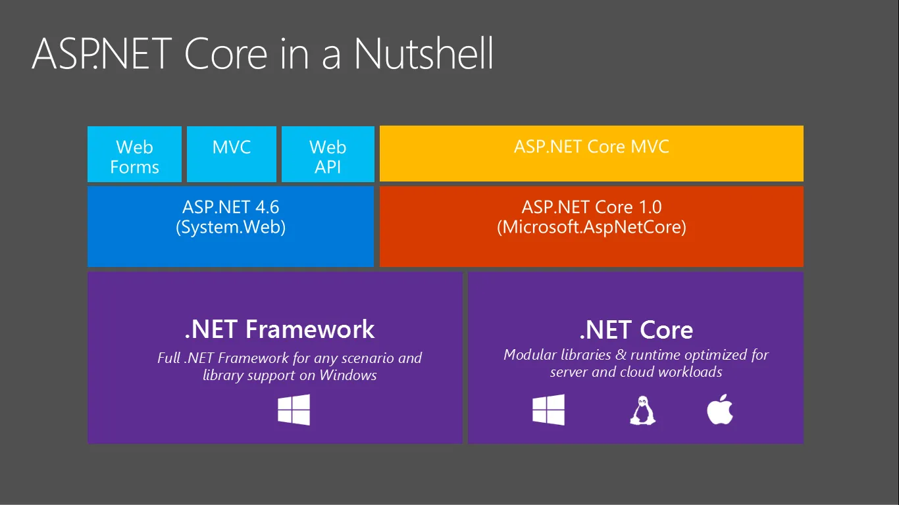

Processing CPU-intensive data.
Queuing work items in the background.
Performing a time-based operation on a schedule.
Background service processing usually doesn't involve a user interface (UI), but UIs can be built around them. In the early days with .NET Framework, Windows developers could create Windows Services for these reasons. Now with .NET, you can use the BackgroundService, which is an implementation of IHostedService, or implement your own.

<!--truncate-->

There are numerous reasons for creating long-running services such as:

With .NET, you're no longer restricted to Windows. You can develop cross-platform background services. Hosted services are logging, configuration, and dependency injection (DI) ready. They're a part of the extensions suite of libraries, meaning they're fundamental to all .NET workloads that work with the generic host.

:::tip

Installing the .NET SDK also installs the Microsoft.NET.Sdk.Worker and the worker template. In other words, after installing the .NET SDK, you could create a new worker by using the dotnet new worker command. If you're using Visual Studio, the template is hidden until the optional ASP.NET and web development workload is installed.

:::

Terminology
Many terms are mistakenly used synonymously. In this section, there are definitions for some of these terms to make their intent more apparent.

Background Service: Refers to the BackgroundService type.
Hosted Service: Implementations of IHostedService, or referring to the IHostedService itself.
Long-running Service: Any service that runs continuously.
Windows Service: The Windows Service infrastructure, originally .NET Framework centric but now accessible via .NET.
Worker Service: Refers to the Worker Service template.
Worker Service template
The Worker Service template is available to the .NET CLI, and Visual Studio. For more information, see .NET CLI, dotnet new worker - template. The template consists of a Program and Worker class.
